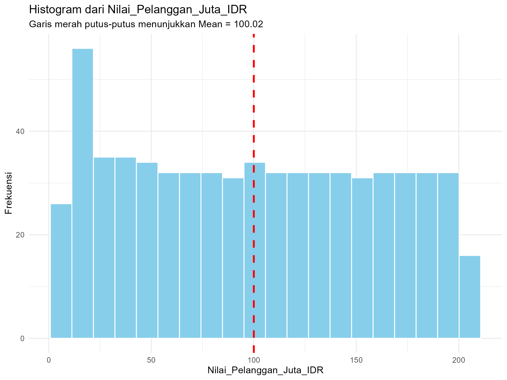
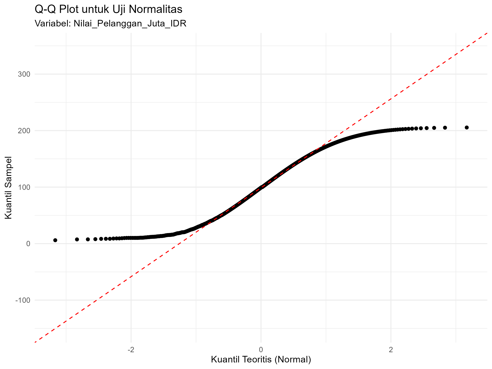

# Tugas Analisis Statistik: Deskriptif, Korelasi, dan Regresi

## 1. Informasi Penyusun

- **Nama:** `[RYAN EDBERT ALFREDO]`
- **NIM:** `[2515101020]`
- **Program Studi:** `[ILMU KOMPUTER]`
- **Mata Kuliah:** Statistika dan Probabilitas

---

## 2. Deskripsi Proyek

> Dataset yang digunakan adalah data sturtup yang berisi informasi tentang pendapatan, biaya akuisisi, nilai pelanggan, dll. Variabel kunci dalam dataset ini meliputi variabel Nilai_Pelanggan_Juta_IDR, variabel Biaya_Akuisisi_Pelanggan_Juta_IDR, dan variabel Pendapatan_Tahunan_Miliar_IDR.
Tujuan dari proyek ini adalah untuk memahami karakteristik data melalui statistik deskriptif, menguji hubungan antara variabel Nilai_Pelanggan_Juta_IDR dan variabel Biaya_Akuisisi_Pelanggan_Juta_IDR melalui analisis korelasi, serta memprediksi variabel Pendapatan_Tahunan_Miliar_IDR menggunakan variabel Nilai_Pelanggan_Juta_IDR sebagai prediktor melalui analisis regresi.


---

## 3. Struktur Proyek

Proyek ini diorganisir ke dalam beberapa folder:
- `/data`: Berisi dataset mentah yang digunakan untuk analisis.
- `/scripts`: Berisi semua skrip R yang digunakan dalam analisis, diurutkan berdasarkan alur kerja.
- `/results`: Berisi output dari analisis, seperti plot, gambar, atau tabel ringkasan.

---

## 4. Cara Menjalankan Analisis

Untuk mereproduksi hasil analisis ini, ikuti langkah-langkah berikut:
1. Pastikan Anda memiliki R dan RStudio terinstal.
2. Buka proyek R ini di RStudio.
3. Instal paket yang diperlukan dengan menjalankan perintah berikut di konsol R:
   ```R
   # install.packages(c("tidyverse", "corrplot", "knitr"))
   ```
4. Jalankan skrip di dalam folder `/scripts` secara berurutan, mulai dari `01_data_preparation.R` hingga `05_analisis_regresi.R`.

---

## 5. Hasil dan Interpretasi

Di bagian ini, mahasiswa diharapkan untuk menyajikan dan menginterpretasikan hasil dari setiap tahap analisis.

### 5.1. Statistik Deskriptif
- **Ukuran Pemusatan (Mean, Median, Modus):**
  - Mean: 100.02, Median: 98.71, Modus: 10.11
  - Interpretasi: Nilai mean sebesar 100.02 menunjukkan rata-rata nilai pelanggan berada di sekitar 100. Median sebesar 98.71 menandakan bahwa setengah dari data memiliki nilai di bawah angka tersebut dan setengahnya lagi di atasnya, sehingga median cukup mewakili kondisi data secara umum. Modus sebesar 10.11 menunjukkan bahwa nilai yang paling sering muncul berada pada kisaran yang jauh lebih rendah dibandingkan mean dan median. Perbedaan ini mengindikasikan bahwa meskipun sebagian besar data berada di sekitar nilai menengah, terdapat kelompok nilai kecil yang sering muncul serta nilai-nilai yang lebih besar sehingga mendorong rata-rata tetap tinggi.
- **Ukuran Sebaran (Standar Deviasi, Range, Kuartil):**
  - Standar Deviasi: 59.86, Range: 6.01 - 205.46, 1st Qu: 45.66, 3rd Qu: 152.08
  - Interpretasi: Nilai minimum sebesar 6.01 dan maksimum 205.46 menandakan bahwa data memiliki rentang yang cukup lebar, sehingga variasi antar pengamatan tergolong besar. Kuartil pertama (45.66) berarti 25% data berada di bawah nilai tersebut, sedangkan kuartil ketiga (152.08) menunjukkan 75% data berada di bawah nilai ini. Dan nilai standar deviasi sebesar 59.86 menunjukkan bahwa nilai pelanggan menyebar cukup jauh dari rata-ratanya, sehingga variasi data tergolong tinggi. 
- **Visualisasi (Histogram/Boxplot):**
  - *<a href="#"></a>*
  - Interpretasi: Histogram menunjukkan bahwa nilai pelanggan tersebar cukup merata dari nilai rendah hingga tinggi, tanpa adanya satu kelompok nilai yang sangat dominan. Garis mean yang berada di sekitar 100 dan terletak di tengah distribusi menandakan bahwa rata-rata cukup mewakili pusat data. Bentuk distribusi yang relatif seimbang dan tidak menunjukkan kemencengan ekstrem ke kiri maupun ke kanan mengindikasikan bahwa nilai pelanggan bervariasi namun tersebar secara merata, sehingga tidak ada konsentrasi kuat pada nilai tertentu dan variasi data terjadi secara wajar.

### 5.2. Uji Normalitas
- **Hasil Uji Shapiro-Wilk:**
  - Nilai p-value: 0
  - Interpretasi: Nilai p-value = 0 atau kurang dari tingkat signifikansi atau alpha (α), berarti data tidak berdistribusi normal. Dengan kata lain, bentuk sebaran data tidak mengikuti pola garis lurus. Dampaknya, perhitungan yang mengandalkan asumsi data normal kurang tepat jika digunakan langsung. Oleh karena itu, analisis sebaiknya menggunakan metode yang tidak mensyaratkan distribusi normal, dan untuk menggambarkan data secara umum, median lebih baik digunakan daripada mean.
- **Plot Q-Q:**
  - <a href="#"></a>
  - Interpretasi: Dalam plot Q–Q tersebut, titik titik data tidak mengikuti garis lurus, melainkan membentuk pola melengkung atau kurva. Ini merupakan indikasi dari kondisi bahwa distribusi data tersebut tidak berdistribusi secara normal. Perbedaan yang cukup signifikan terhadap garis lurus, terutama pada titik awal maupun titik akhir atau ekor distribusi tersebut, berarti ada ketidaknormalan yang bersifat memencang (skewness) atau perbedaan sebaran dibandingkan distribusi normal. Oleh karena itu, dapat dinyatakan bahwa distribusi dari data tersebut tidak normal, maka itu asumsi yang memerlukan normalitas dan perlu dimperhatikan dan diperbaiki atau diganti dengan metode non parametrik misalnya.

### 5.3. Analisis Korelasi
- **Nilai Koefisien Korelasi:**
  - Nilai r: 1
  - Interpretasi: Nilai r = 1 menunjukkan bahwa hubungan antara dua variabel sangat kuat dan bersifat positif sempurna. Artinya, setiap peningkatan pada satu variabel selalu diikuti oleh peningkatan yang sebanding pada variabel lainnya tanpa adanya penyimpangan. Dengan kata lain, kedua variabel bergerak searah secara konsisten, sehingga hubungan yang terbentuk merupakan korelasi positif kuat.
- **Visualisasi (Scatter Plot):**
  - *<a href="#"></a>*
  - Interpretas: Pola pada scatter plot sangat mendukung hasil koefisien korelasi (r = 1). Dimana titik-titik data terlihat berjajar hampir tepat pada satu garis lurus yang menanjak, ini menunjukkan hubungan linear positif yang kuat antara biaya akuisisi pelanggan dan nilai pelanggan. Artinya, setiap peningkatan biaya akuisisi selalu diikuti oleh peningkatan nilai pelanggan secara konsisten. Minimnya penyimpangan titik dari garis tren menguatkan bahwa hubungan kedua variabel tersebut searah dan hampir sempurna, sesuai dengan makna korelasi positif kuat.

### 5.4. Analisis Regresi
- **Model Regresi:**
  - Persamaan regresi: Y = b0 + b1*X
  - Interpretasi:
	- Y = Biaya_Akuisisi_Pelanggan_Juta_IDR
	- b0 = Intercept
	- b1 = Slope
 	- X = Nilai_Pelanggan_Juta_IDR

- **Evaluasi Model (R-squared):**
  - Nilai R-squared: 1 atau 100%
  - Interpretasi: Artinya, 100 % variasi pada Biaya_Akuisisi_Pelanggan_Juta_IDR dapat dijelaskan oleh Nilai_Pelanggan_Juta_IDR melalui model ini.
- **Visualisasi (Garis Regresi pada Scatter Plot):**
  - *<a href="#"></a>*
  - Interpretasi: Garis regresi pada grafik merepresentasikan hubungan linear positif yang sangat kuat antara nilai pelanggan dan biaya akuisisi pelanggan. Arah garis yang menuju ke arah kanan atas menunjukkan bahwa semakin besar nilai pelanggan, semakin besar pula biaya akuisisi yang dikeluarkan. Titik-titik data yang hampir seluruhnya berada tepat di sepanjang garis regresi, serta nilai Adjusted R-squared = 1, menandakan bahwa hubungan kedua variabel ini sangat konsisten dan nyaris sempurna, sehingga perubahan pada nilai pelanggan dapat menjelaskan perubahan biaya akuisisi pelanggan secara hampir keseluruhan.
---

## 6. Kesimpulan

Berdasarkan seluruh analisis yang telah dilakukan, data menunjukkan bahwa nilai pelanggan dan biaya akuisisi pelanggan memiliki hubungan yang sangat kuat dan searah. Statistik deskriptif memperlihatkan data cukup beragam atau acak, dengan sebaran nilai yang lebar, namun ukuran pemusatan (mean dan median) relatif berdekatan sehingga pusat data cukup representatif. Hasil uji normalitas menunjukkan data tidak terdistribusi dengan normal, sehingga analisis perlu dilakukan dengan metode lain contohnya seperti non parametrik. Analisis korelasi menghasilkan nilai r = 1, yang berarti hubungan positif sangat kuat, dan diperkuat oleh analisis regresi dengan R-squared mendekati 1, menandakan hampir seluruh variasi biaya akuisisi dapat dijelaskan oleh nilai pelanggan.
Wawasan paling penting dari analisis ini adalah bahwa semakin tinggi nilai pelanggan, semakin besar biaya akuisisi yang dikeluarkan, dan hubungan tersebut sangat konsisten serta linear.
